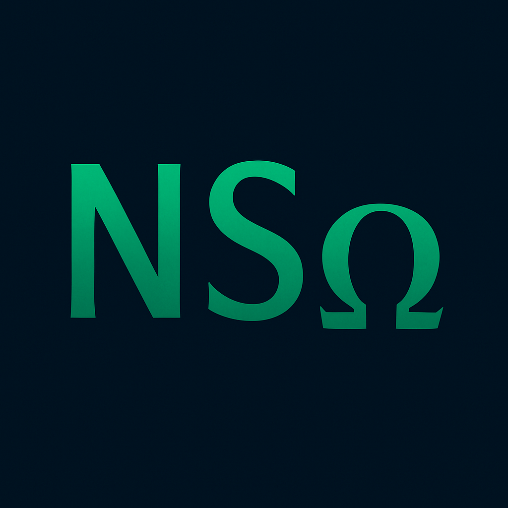

  

# NSω: Neural Superoscillatory Hybrid Framework

**NSω** (*Neural Superoscillatory Omega*) is a research and prototyping framework that integrates **superoscillatory phenomena** and **weak measurement protocols** into deep neural network architectures.  
It provides the foundational tools to **design, simulate, and analyze** neural systems that operate **beyond the classical Nyquist limit**.

---

## 🧠 Core Concepts

- **Superoscillations**: Localized waveforms that oscillate faster than the highest frequency present in the global Fourier spectrum.
- **Weak Measurements**: Quantum-inspired probes that extract information with minimal disturbance, implemented in neural settings.
- **Fourier Deformations**: Nonlinear computational layers based on spectral distortion principles.

---

## 📦 Repository Structure

| Folder         | Content Description |
|----------------|----------------------|
| `layers/`      | Custom PyTorch modules (e.g. `SuperOscLayer`) |
| `metrics/`     | Scripts to compute SEI, WMC, NFDC and simulate weak measurements |
| `datasets/`    | Synthetic datasets: `SuperOsc-MNIST`, `Temporal-Chirp` |
| `notebooks/`   | Interactive experiments, e.g. `SuperOsc_Test.ipynb` |
| `visuals/`     | Logos, diagrams, results |
| `configs/`     | Configuration files for reproducible experiments |

---

## 📊 Key Metrics

| Metric | Description |
|--------|-------------|
| **SEI** | *Superoscillatory Enhancement Index*: measures recovery of information beyond bandwidth |
| **WMC** | *Weak Measurement Coherence*: evaluates coherence of extracted weak values |
| **NFDC** | *Neural Fourier Deformation Coefficient*: quantifies frequency-space deviation |

---

## 🧪 Example Notebook

📓 [`notebooks/SuperOsc_Test.ipynb`](notebooks/SuperOsc_Test.ipynb):
- Compares standard vs.

